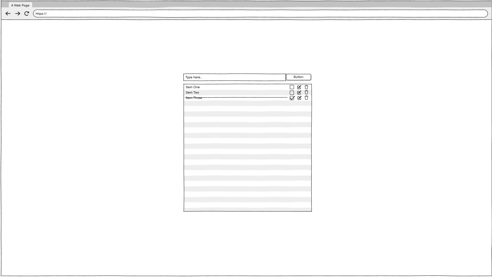

# To-Do List App

A simple and clean to-do list application built with HTML, CSS, and JavaScript. It allows users to add, complete, and remove tasks with ease.

## ✨ Features

- Add new tasks  
- Mark tasks as completed by clicking  
- Remove tasks by double-clicking  
- Responsive and minimal design

## 🧑‍💻 User Stories

- As a user, I want to **add a new task** so that I can keep track of things I need to do.  
- As a user, I want to **see a list of all my tasks** so that I can stay organised.  
- As a user, I want to **mark a task as completed** so that I know what I’ve finished.  
- As a user, I want to **delete a task** so that I can remove tasks I no longer need.  
- As a user, I want to **edit a task’s text** so that I can correct mistakes or update details.

## 🚀 Getting Started

### Clone the Repository

```bash
git clone https://github.com/your-username/todo-list-app.git
cd todo-list-app
```

## 🚀 Getting Started

### Open in Browser

Open `index.html` in your preferred browser.

## 🛠️ Built With

- HTML5  
- CSS3  
- Vanilla JavaScript  
- [Balsamiq](https://balsamiq.com/) – for wireframing 

## 🖼️ Wireframe

Below is the initial wireframe created in Balsamiq:



## 💡 How to Use

1. Enter a task into the input field.  
2. Click "Add Task" or press `Enter` to add it.  
3. Click a task to mark it as completed.  
4. Double-click a task to delete it.

## 🌐 Live Demo

[View on GitHub Pages](https://yourusername.github.io/todo-list-app)

## 📄 License

This project is licensed under the MIT License.

